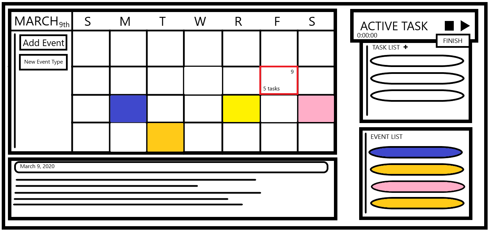

###### **Productivity Tracker - WIP**

**Overview**

  WIP

**Features**

- Calendar
  
        Highlights current day,
        Add/remove color coded events,
        Custom event types,
        Displays number of daily tasks,
- Journal
    
        Displays new entry daily,
        Logs task summaries,
        Plain text area for user notes
  
- Task tracker
  
        Active task bar displays task in progress,
        Start, pause, resume, & finish active task,
        Finishing active task prompts user for notes
        then submits notes and time to completion to daily journal,
        Add/remove tasks and sort by dragging
- Event tracker
        
        List of events that sorts by date

**Technologies - WIP**

Spring Boot, Spring Web, Spring Data Rest, Spring Security, Thymeleaf

